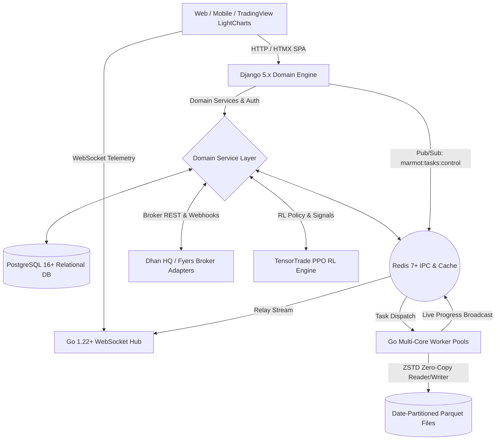

# Marmot Enterprise Trading & Backtesting Platform

[](https://golang.org)
[](https://python.org)
[](https://djangoproject.com)
[](https://docker.com)
[](https://tradingview.com)

---

## 1. Executive Summary & Vision

**Marmot** is an institutional-grade algorithmic trading, quantitative research, and ultra-high-performance backtesting platform engineered specifically for **Indian Equity Derivatives (NSE/BSE F&O)** and **Global Forex**.

### Core Value Proposition
- **High-Throughput Parallel Backtesting:** Eliminates analytical bottlenecks by executing multi-year intraday options strategies across hundreds of millions of ticks and 1-minute bars in seconds using a compiled Go multi-core worker engine.
- **Continuous Contract Simulation:** Resolves historical options trading anomalies by binding position tracking directly to the exact underlying strike contract throughout its trade lifecycle, eliminating rolling ATM discontinuities and synthetic price jumps.
- **Institutional Market Simulation:** Models dynamic bid-ask spreads, order-size slippage, exchange queue latencies, and the full Indian regulatory tax matrix (Brokerage, STT, Exchange turnover, Stamp duty, GST, and SEBI charges).
- **Dual-Engine Architecture:** Unites Django 5.x (domain modeling, ORM, HTMX Single Page Application, and REST APIs) with Go 1.22+ (low-latency WebSockets, zero-copy Apache Parquet processing, and parallel worker pools).
- **TensorTrade Reinforcement Learning (RL):** Features an advanced PPO engine equipped with dynamic intraday momentum guardrails, 15-minute Opening Range Breakout (ORB) filters, anti-theta time-stops, and a two-tier stop-loss framework.

---

## 2. System Architecture

Marmot deploys a dual-engine architecture communicating asynchronously via **PostgreSQL 16+** and **Redis 7+ Pub/Sub & Caching**.



### Technology Stack
- **Backend Domain Engine:** Python 3.12+ (Django 5.x)
- **High-Concurrency Microservices:** Go 1.22+ (Goroutines, atomic operations, sync pools)
- **Data Serialization & Compression:** Apache Parquet (ZSTD & Snappy compression)
- **Message Broker & IPC:** Redis 7+ (Pub/Sub task control and atomic progress caches)
- **Primary Relational Store:** PostgreSQL 16+
- **Frontend & UI:** Server-rendered Django Templates + HTMX (Dynamic SPA) + Bootstrap 5 + TradingView LightweightCharts
- **Containerization:** Multi-container Docker Compose architecture

---

## 3. Core Subsystems & Functional Modules

```text
marmot/
├── apps/
│   ├── admins/           # Admin operations, telemetry dashboards, and audit logs
│   ├── api/              # RESTful endpoints for mobile and headless API access
│   ├── backtest/         # Backtest orchestration, RL engine, chart views, and models
│   ├── common/           # Shared mixins, choices, constants, and utilities
│   ├── market/           # Market data structures, option chains, and quote proxies
│   ├── masters/          # Exchange master contracts, security tokens, and holiday calendars
│   ├── notifications/    # Multi-channel notifications (Webhooks, Email, System alerts)
│   ├── postback/         # Broker webhook postback ingestion and order reconciler
│   ├── trade_config/     # Risk limits, capital guards, and freeze configurations
│   ├── trade_core/       # Plug-and-play broker adapters (Dhan, Fyers, Paper Trading)
│   └── users/            # Custom User model, RBAC, and permissions
├── backup/               # Local date-partitioned Apache Parquet datasets
├── go-app/               # Compiled Go 1.22+ Microservice Engine
│   ├── config/           # Environment configuration and connection pools
│   ├── models/           # Parquet schemas and Redis IPC command payloads
│   ├── services/         # DB connection, Parquet reader/writer, and chart handlers
│   ├── strategies/       # Algorithmic strategies (ICT/SMC, Gamma Blast, 3PM Breakout)
│   ├── workers/          # Parallel backtest and historical data backup worker pools
│   ├── ws/               # High-concurrency WebSocket Hub (`hub.go`)
│   └── main.go           # Go microservice entry point
└── templates/            # HTMX dynamic templates and responsive modal layouts
```

---

## 4. Reinforcement Learning (RL) & Quantitative Engine

Located at `apps/backtest/rl_engine.py`, the Marmot RL trading engine integrates **TensorTrade** and **Proximal Policy Optimization (PPO)** for algorithmic option buying and selling.

### Continuous Fixed-Strike Contract Tracking
- **The Problem:** Traditional options backtesting frequently looks up synthetic rolling ATM strike tags at every minute. In trending markets, this causes artificial position hops from one strike to another, creating synthetic gap-ups/gap-downs.
- **The Marmot Solution:** When the RL agent or strategy initiates an entry, the engine records the exact underlying strike contract (`strike_val = 24700`) and relative option strike tag. Throughout the trade's forward trajectory, the engine continuously tracks and resolves candles for that specific strike until formal exit, guaranteeing 100% realistic PnL accounting.

### Two-Tier Stop Loss Architecture
- **Initial Stop Loss (`initial_stop_loss_price`):** Immutable entry risk anchor used to calculate pure Risk-to-Reward (RR) ratios (1:1.75 or 1:2.5) and target prices. Eliminates inverted risk zones on visual charts.
- **Trailing Stop Loss (`trailing_stop_loss_price`):** Dynamic trailing mechanism protecting accumulated gains. Once price gains exceed +10 points, the trailing stop automatically moves to breakeven (+2 points), preventing winning trades from turning into losses.

### Unified Professional Intraday Momentum Guardrails
Seeded via `python manage.py seed_backtest_rules`, this rule enforces disciplined execution:
1. **15-Minute Opening Range (ORB):** Prevents blind 09:15 entries by establishing the high and low range between 09:15 and 09:30.
2. **EMA 9/21 Trend Confirmation:** Enforces bullish continuation (Fast EMA > Slow EMA) for Long CE entries and bearish continuation for Long PE entries.
3. **45-Minute Anti-Theta Time-Stop:** Automatically closes stagnant long option positions after 45 minutes to protect capital against severe intraday theta decay.
4. **Dynamic Lot Sizing & Expiry Awareness:** Automatically adjusts position sizing based on historical exchange lot revisions.

---

## 5. Visual Telemetry & Analysis UI

Marmot features an interactive, dark-themed **TradingView LightweightCharts** modal interface integrated via HTMX partial rendering:

- **Spot-Based Vectorized Strike Extraction:** Directly queries date-partitioned Parquet files to retrieve minute-by-minute candles for the specific option contract traded.
- **UTC-to-IST Market Timescale:** Native timestamp conversion ensures seamless alignment with Indian market trading hours (09:15 to 15:30 IST).
- **Crosshair OHLCV Telemetry:** Instantaneous tooltip updates detailing Open, High, Low, Close, Volume, and candlestick percentage changes.
- **Floating Risk & Telemetry HUD:** Displays real-time entry price, exit price, initial stop loss, trailing stop loss, target price, and net PnL points.
- **Multi-Drawer Performance Metrics:** Responsive 3-column drawer breakdown showing trade duration, gross PnL, charges, net ROI, and capital efficiency.

---

## 6. Exchange Accounting & Regulatory Compliance

Every trade executed or simulated on Marmot adheres to Indian exchange regulations and statutory taxation:

### Dynamic Date-Aware Lot Sizes
Implemented in `get_historical_lot_size(index_name, date)`:
- **NIFTY:** 75 (pre-2021) $\rightarrow$ 50 (2021–2024) $\rightarrow$ 25 (post-Nov 2024)
- **BANKNIFTY:** 25 (pre-2023) $\rightarrow$ 15 (2023–2024) $\rightarrow$ 30 (post-Nov 2024)
- **FINNIFTY / SENSEX / BANKEX:** Dynamically resolved per historical regulatory mandate.

### Indian Statutory Tax Matrix (`calculate_trade_charges`)
- **Brokerage:** ₹20 flat per executed order.
- **Securities Transaction Tax (STT):** 0.125% on option sell turnover.
- **Exchange Turnover Charges:** 0.05% of trade premium turnover.
- **Goods and Services Tax (GST):** 18% on (Brokerage + Exchange Charges + SEBI Fees).
- **Stamp Duty:** 0.003% on option buy turnover.
- **SEBI Turnover Charges:** ₹10 per crore of turnover.

### Utilized Capital Metrics
In addition to Total Account ROI, Marmot measures and reports:
- **Max Utilized Capital:** Peak margin allocated across all open positions.
- **Average Utilized Capital:** Time-weighted capital deployed.
- **Capital Utilization %:** Percentage of total available capital actively at risk.
- **ROI on Utilized Capital:** Realistic return efficiency reflecting actual capital employed.

---

## 7. Institutional Governance & Operational Risk Controls

- **Multi-Tier Freeze Architecture:** Granular flags (`primary_freeze`, `final_freeze`) protect institutional capital against anomalous volatility, network disconnects, or rogue execution loops.
- **User Profile Field Security:** Strict read-only enforcement for `username`, `phone_number`, verification badges, broker credentials (write-once), and trade eligibility flags.
- **Full-Width Layout Uniformity:** Consistent full-width container standard (`col-12`) applied across all administration, analytics, and settings views.

---

## 8. Quick Start & Docker Deployment

### Prerequisites
- Docker Engine 24.0+ and Docker Compose v2+
- Valid broker credentials (e.g., Dhan HQ Client ID and Access Token)

### Multi-Container Startup
```bash
# 1. Clone the repository and configure environment variables
cp .env.example .env

# 2. Build and launch all microservices in detached mode
docker compose up -d --build

# 3. Apply database migrations
docker compose exec django_app python manage.py migrate

# 4. Seed unified quantitative strategy rules
docker compose exec django_app python manage.py seed_backtest_rules

# 5. Create an administrator account
docker compose exec django_app python manage.py createsuperuser
```

### Active Endpoints
| Component | Endpoint | Description |
| :--- | :--- | :--- |
| **Django Application** | `http://localhost:8000` | Web UI, HTMX SPA, and REST APIs |
| **Go WebSocket Hub** | `ws://localhost:8080/ws` | High-frequency telemetry stream |
| **Adminer Database UI** | `http://localhost:8081` | Direct PostgreSQL database administration |

---

## 9. Redis IPC Command Payload Specifications

Django communicates with Go background workers by publishing JSON payloads to Redis channel `marmot:tasks:control`:

### Data Backup Trigger (`START_BACKUP`)
```json
{
  "command": "START_BACKUP",
  "task_id": "b128f731-9043-4ce2-bdf2-f81d5854721a",
  "params": {
    "user_id": "1",
    "index_name": "NIFTY",
    "security_id": "13",
    "start_date": "2024-01-01",
    "end_date": "2024-12-31",
    "strike_count": 10,
    "dhan_client_id": "1000000000",
    "dhan_access_token": "eyJhbGciOi..."
  }
}
```

### High-Performance Backtest Trigger (`START_BACKTEST`)
```json
{
  "command": "START_BACKTEST",
  "task_id": "96b6f4e2-45e8-46d5-8f6b-12d8a4365319",
  "params": {
    "user_id": "1",
    "backup_task_id": "b128f731-9043-4ce2-bdf2-f81d5854721a",
    "strategy_name": "momentum_guardrail",
    "index_name": "NIFTY",
    "start_date": "2024-01-01",
    "end_date": "2024-12-31"
  }
}
```

---

## 10. Future Development Vision & Strategic Roadmap

Marmot is architected to evolve into a complete institutional quantitative fund engine. The upcoming strategic phases include:

```mermaid
timeline
    title Strategic Development Roadmap
    section Phase 1: Low-Latency Execution
        Go DMA Gateway : Direct Dhan/Fyers WebSocket order routing
        Sub-Millisecond Risk Checks : Atomic margin and position validation
    section Phase 2: Distributed RL
        Multi-Agent RL Clusters : Distributed PPO/A2C training across Ray & Go
        Continuous Policy Learning : Live walk-forward reinforcement learning
    section Phase 3: Market Microstructure
        Order Flow Imbalance (OFI) : L2/L3 order book pressure analytics
        Gamma Exposure (GEX) Heatmaps : Institutional option dealer gamma tracking
    section Phase 4: Smart Order Routing
        Cross-Broker SOR : Multi-broker capital and margin allocation
        Automated Portfolio Hedging : Delta-neutral option writing & tail-risk protection
```

### Phase 1: Low-Latency Go Execution Gateway
- **Direct Broker WebSockets:** Implement a compiled Go OMS (Order Management System) establishing low-latency binary/JSON WebSocket connections to Dhan HQ and Fyers.
- **Sub-Millisecond Pre-Trade Risk:** Perform pre-trade margin calculations, position sizing, and freeze validations in Go before dispatching orders to broker gateways.

### Phase 2: Distributed Multi-Agent RL Training Clustering
- **Ray + Go Parquet Streaming Integration:** Scale TensorTrade RL training across multi-node clusters reading date-partitioned Parquet datasets in parallel.
- **Continuous Walk-Forward Adaptation:** Transition from static historical backtesting to continuous walk-forward model adaptation with automated policy validation.

### Phase 3: Market Microstructure & Order Flow Analytics
- **Order Flow Imbalance (OFI) & VPOC:** Ingest Level 2/3 market depth to calculate real-time order flow imbalances, Volume Point of Control (VPOC), and Value Area High/Low (VAH/VAL).
- **Dealer Gamma Exposure (GEX) Profiling:** Track cumulative strike open interest and dealer gamma positioning to anticipate explosive gamma squeezes and pinning on expiry days.

### Phase 4: Smart Order Routing (SOR) & Dynamic Portfolio Hedging
- **Multi-Broker Allocation:** Intelligently route order slices across multiple broker accounts based on margin availability, execution speed, and fill rates.
- **Autonomous Delta-Neutral Hedging:** Combine automated algorithmic option writing with dynamic underlying futures hedging and systematic tail-risk option buying.
