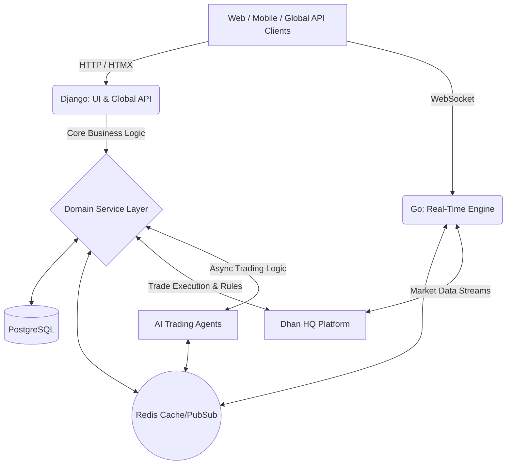

# Marmot Enterprise Platform

## 1. Project Overview
Marmot is a high-performance F&O backtesting and automated trading platform built with a dual-architecture.
It leverages a Domain-Driven Service Layer bridging dynamic HTMX UIs and globally compatible RESTful APIs, designed for seamless AI Agent Automation.

## 2. Technology Stack
- **Backend Frameworks:** Django (Python), Go (Microservices)
- **Frontend:** HTMX
- **Databases & Brokers:** PostgreSQL (PSQL), Redis
- **Real-Time Communication:** Websocket
- **Broker Integration:** Dhan HQ Platform (Planned for all market data ingestion and trade execution)

## 3. Core Architecture & Flow
- **HTMX Frontend:** Delivers SPA-like interactions via server-rendered HTML partials with zero JS framework overhead.
- **Globally Compatible API:** Decoupled JSON REST endpoints built for global accessibility by mobile apps, external platforms, and webhooks.
- **Go Microservices:** Dedicated Go application (`go-app/`) for handling high-frequency websocket streams and background tasks.
- **Shared Service Layer:** Business logic, authorization, and data queries live in reusable service modules serving both UI and API.
- **AI-Ready Engine:** Asynchronous worker infrastructure ready for autonomous trading agents.

### Working Flowchart

## 4. AI-Driven Development Rules
**CRITICAL:** All AI agents and developers must strictly adhere to the following rules during code generation and modification:
1. **Required Changes Only:** Do only required changes. Do not modify unrelated code or apply broad refactoring.
2. **Docstring Limits:** 1 or 2 line docstring max per function/class/module. Keep documentation extremely concise.
3. **Space Accountability:** Even a blank space change is accountable. Do not introduce trailing spaces or unnecessary blank lines.
4. **Clean Imports:** Always keep the import clean. Remove unused imports and group them logically.

## 5. Directory Structure
- `apps/`: Django modules (api, users, trade_core, trade_config, market, notifications, masters, common, ai_agents).
- `go-app/`: Go-based workers and websocket handlers (`main.go`, `config`, `models`, `services`, `workers`).
- `marmot/`: Django core configuration.
- `templates/`: HTML templates and HTMX partials.

## 6. Quick Start Guide
1. Clone the repository and configure `.env` (e.g., `cp .env.example .env`).
2. Build and start services in detached mode: `docker-compose up -d --build`.
3. Verify running containers: Django (`8000`), Adminer (`8080`), Postgres (`5432`), Redis (`6379`).
4. Apply database migrations: `docker exec -it django_app python manage.py migrate`.
5. Create a superuser: `docker exec -it django_app python manage.py createsuperuser`.
