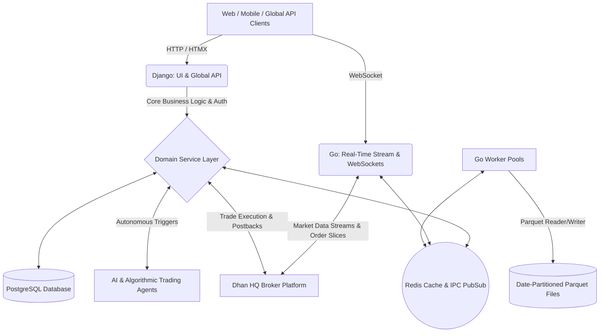

# Marmot Enterprise Trading & Backtesting Platform

## 1. Executive Summary & Vision

**Marmot** is an institutional-grade algorithmic trading and high-performance backtesting platform engineered specifically for Indian Equity Derivatives (NSE F&O). 

### Vision & Purpose
- **Ultra-Fast Parallel Backtesting:** Eliminate backtesting bottlenecks by executing multi-year intraday options strategies across hundreds of millions of ticks/candles in seconds using a compiled Go worker engine.
- **Scientific Market Simulation:** Provide realistic execution modeling with dynamic bid-ask spreads, volume-based market impact slippage, exchange queue latencies, and the complete Indian regulatory fee structure (STT, GST, Exchange turnover, Stamp duty, SEBI charges).
- **Dual-Architecture Efficiency:** Seamlessly unite Django’s rich domain modeling, ORM, and HTMX server-rendered interfaces with Go’s low-latency concurrency, WebSockets, and zero-copy Apache Parquet processing.
- **Institutional Risk & Control:** Hardened multi-layer risk controls including dynamic freeze flags, kill switches, capital allocation guards, and strict trader eligibility enforcement.

---

## 2. System Architecture

Marmot utilizes a dual-engine architecture communicating asynchronously through **PostgreSQL** and **Redis Pub/Sub & Caching**.



### Technology Stack
- **Backend Core:** Python 3.12+ (Django 5.x) & Go 1.22+
- **Database & Storage:** PostgreSQL 16+, Apache Parquet (ZSTD/Snappy compression)
- **Message Broker & IPC:** Redis 7+
- **Frontend & UI:** Server-rendered Django Templates + HTMX (zero heavy JS framework overhead) + Bootstrap 5 + Chart.js
- **Broker Connectivity:** Dhan HQ REST & WebSocket APIs
- **Containerization:** Docker Compose multi-container environment

---

## 3. Core Subsystems & Functional Modules

### A. Market Data Ingestion & Parquet Backup Engine (`go-app/workers/backup_job.go`)
- **Automated Data Harvesting:** Ingests intraday 1-minute/tick OHLCV and market depth for underlying indices (NIFTY, BANKNIFTY, FINNIFTY, SENSEX) and their option chains directly from Dhan HQ.
- **Dynamic Strike Selection:** Automatically resolves ATM $\pm N$ Call (CE) and Put (PE) strike contracts based on spot price at each timestamp.
- **Partitioned Parquet Architecture:** Consolidates raw streaming data into date-partitioned binary Parquet files (`/app/backup/{user_id}/{task_id}/dataset.parquet` and `/app/backup/{user_id}/{task_id}/{index}_options/`).
- **Real-Time Telemetry:** Live websocket updates and atomic progress tracking dispatched to Redis and Django UI.

### B. High-Performance Go Backtest Engine (`go-app/workers/backtest_job.go`)
- **Parallel Worker Pools:** Evaluates 5+ years of multi-strike options datasets concurrently across all CPU cores in under 4 seconds.
- **Realistic Execution Simulation:**
  - **Dynamic Slippage:** Volatility and order-size-adjusted market impact modeling ($\sigma \times \sqrt{V_{\text{order}}/V_{\text{bar}}}$).
  - **Regulatory Tax Matrix:** Automatic deduction of Brokerage (₹20/order), STT (0.125% on option sell), Exchange Turnover Fee (0.05%), GST (18%), Stamp Duty (0.003%), and SEBI charges.
  - **Dynamic Expiry Resolution:** Resolves holiday shifts, special sessions, and regulatory expiry calendar alterations directly from contract symbol metadata.
- **Statistical & Quantitative Validation:**
  - Standard Metrics: Total Trades, Win Rate %, Net PnL, Profit Factor, Max Drawdown (MDD), Drawdown Duration.
  - Statistical Rigor: Probabilistic Sharpe Ratio (PSR), Deflated Sharpe Ratio (DSR), Sortino Ratio, and Value at Risk (VaR 95/99%).

### C. Strategy Evaluation Registry (`go-app/strategies/`)
1. **ICT / Smart Money Concepts (`ict_smc.go`):** Identifies Fair Value Gaps (FVG), Order Blocks (OB), Liquidity Pool Sweeps, and Market Structure Shifts (MSS) across multiple timeframe aggregations.
2. **Expiry 0DTE Gamma Blast (`gamma_blast.go`):** Dynamic scanning between 01:30 PM - 02:45 PM on expiry days for 1-hour range consolidation breakouts, buying low-cost OTM options (₹10 - ₹25) to capture explosive delta/gamma expansion.
3. **3:00 PM Breakout (`candle_3pm.go`):** Volume-expansion and momentum breakout tracker on the 15:00 1-minute candle body.

### D. Trade Core & Risk Management (`apps/trade_core`, `apps/trade_config`)
- **Hardened User Controls:** Granular flags for user trade eligibility, broker credential isolation, and emergency system blocks.
- **Freeze Controls:** Strict multi-tier freezing (`primary_freeze`, `final_freeze`) protecting capital against anomalous volatility or rogue execution loops.
- **Postback Tracking:** Webhook processing for instantaneous broker order acknowledgements, fills, and rejections.

---

## 4. AI-Driven Development & Engineering Rules

All AI agents, automated contributors, and developers must strictly follow these engineering constraints:

1. **Required Changes Only:** Modify only what is strictly requested or essential. No unsolicited broad refactorings or speculative additions.
2. **Docstring Limits:** Maximum 1 to 2 lines per docstring across functions, classes, and modules. Keep documentation concise and high-signal.
3. **Space & Formatting Accountability:** Every whitespace change is strictly accounted for. No trailing spaces, no arbitrary blank lines, and adhere to PEP 8 / `gofmt`.
4. **Clean Imports:** Maintain clean imports at all times. Group logically (standard library, third-party, local) and remove all unused imports.
5. **Page Uniformity & Profile Policy:**
   - Maintain strict full-width container uniformity (`col-12`) across all pages including Profile Settings.
   - **User Profile Security Policy:**
     - `username`: Always read-only.
     - `phone_number`: Read-only for regular users.
     - Verification Badges: Read-only status indicators for regular users.
     - Broker Credentials: Write-once during setup; cannot be altered by regular users (Admin/Developer role required).
     - Trade Control & Freeze Flags (`trade_eligibility`, `is_blocked`, `primary_freeze`, `final_freeze`): Always read-only for standard users.
     - Navigation Placement: Profile settings link belongs exclusively in the top-right profile dropdown menu.

---

## 5. Repository Structure

```text
marmot/
├── .agents/
│   └── rules/                  # AI agent behavioral rules and execution guardrails
│       └── readmd.md
├── apps/                       # Django Domain Apps
│   ├── admins/                 # Admin operations, dashboards, forms & reports
│   ├── api/                    # RESTful endpoints for mobile & external access
│   ├── backtest/               # Backtest management, orchestration & metrics UI
│   ├── common/                 # Shared utilities, choices, mixins, and base models
│   ├── market/                 # Market data structures, instruments, and live feed proxies
│   ├── masters/                # Exchange master lists, holiday calendars, instrument tokens
│   ├── notifications/          # Alerting channels (Email, SMS, Webhook)
│   ├── postback/               # Broker webhook postback handlers
│   ├── trade_config/           # Risk limits, strategy parameters, and freeze configurations
│   ├── trade_core/             # Broker execution clients, order routers, and accounts
│   └── users/                  # Custom User model, authentication, RBAC, and permissions
├── backup/                     # Local parquet datasets and historical raw partitions
├── go-app/                     # High-Performance Go Microservices
│   ├── config/                 # Go environment configuration
│   ├── models/                 # Parquet schemas and IPC command payload definitions
│   ├── services/               # DB connection, Parquet writer/reader, Redis client, chart handler
│   ├── strategies/             # Algorithmic strategy evaluators (ICT/SMC, Gamma, 3PM)
│   ├── workers/                # Parallel backup and backtest worker engines
│   ├── ws/                     # High-concurrency WebSocket Hub and client handlers
│   └── main.go                 # Microservice entry point
├── marmot/                     # Django root configuration and settings
├── static/ & staticfiles/      # CSS, JS, branding assets, and chart bundles
├── templates/                  # HTMX partials and server-rendered HTML templates
├── docker-compose.yml          # Multi-container orchestration (Django, Go, Postgres, Redis, Adminer)
└── requirements.txt            # Python dependencies
```

---

## 6. Quick Start & Execution Guide

### Prerequisites
- Docker Engine 24.0+ & Docker Compose v2+
- Valid Dhan HQ API credentials (for live data downloading & real trading)

### Running with Docker Compose
```bash
# 1. Clone repository and setup environment
cp .env.example .env

# 2. Build and launch all microservices in detached mode
docker compose up -d --build

# 3. Apply database migrations
docker compose exec django_app python manage.py migrate

# 4. Create an administrator account
docker compose exec django_app python manage.py createsuperuser

# 5. Verify service endpoints
# - Django Application: http://localhost:8000
# - Go WebSocket Hub:   ws://localhost:8080/ws
# - Adminer DB UI:      http://localhost:8081
```

---

## 7. Command Payload Specifications (Redis IPC)

Django triggers Go background tasks by publishing JSON payloads to Redis channel `marmot:tasks:control`:

### Data Backup Trigger
```json
{
  "command": "START_BACKUP",
  "task_id": "b128f731-9043-4ce2-bdf2-f81d5854721a",
  "params": {
    "user_id": "1",
    "index_name": "NIFTY",
    "security_id": "13",
    "start_date": "2024-01-01",
    "end_date": "2024-12-31",
    "strike_count": 10,
    "dhan_client_id": "1000000000",
    "dhan_access_token": "eyJhbGciOi..."
  }
}
```

### Backtest Run Trigger
```json
{
  "command": "START_BACKTEST",
  "task_id": "96b6f4e2-45e8-46d5-8f6b-12d8a4365319",
  "params": {
    "user_id": "1",
    "backup_task_id": "b128f731-9043-4ce2-bdf2-f81d5854721a",
    "strategy_name": "ict_smc",
    "index_name": "NIFTY",
    "start_date": "2024-01-01",
    "end_date": "2024-12-31"
  }
}
```
